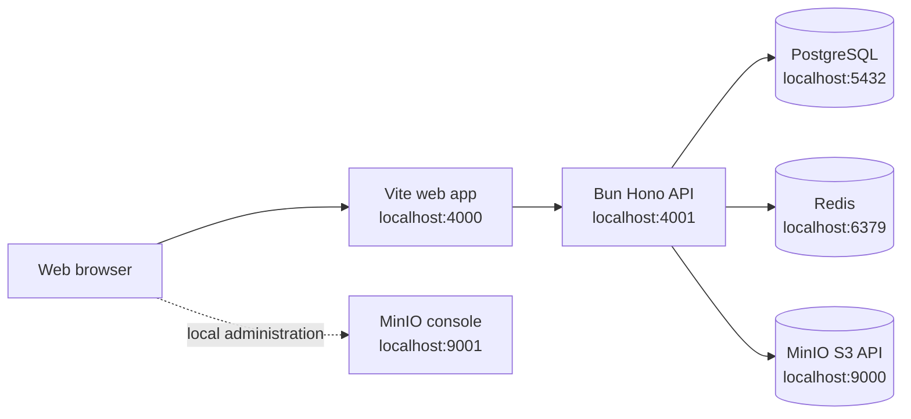

# TeamOS Infrastructure Guide

This guide describes the infrastructure used by TeamOS during local development and the current runtime boundaries between the web app, API, and supporting services.

## Architecture



The application processes run directly through Bun. Docker Compose currently provides PostgreSQL, Redis, and MinIO only.

## Service Map

| Service       | Local port | Current responsibility                | Current integration status                     |
| ------------- | ---------: | ------------------------------------- | ---------------------------------------------- |
| Web           |     `4000` | Vite React client                     | Available through the web app dev command      |
| API           |     `4001` | Hono HTTP API                         | Available through the API dev command          |
| PostgreSQL    |     `5432` | Durable relational data               | Connected at API startup through `@teamos/db`  |
| Redis         |     `6379` | Rate limiting and future coordination | Used by the API rate limiter                   |
| MinIO API     |     `9000` | S3-compatible object storage          | Connected and credential-probed at API startup |
| MinIO console |     `9001` | Local object-storage administration   | Available for local inspection                 |

## Starting Infrastructure

The root `.env` contains Docker Compose variables only. A fresh checkout can use the development defaults without creating that file.

```bash
docker compose up -d
docker compose ps
```

To stop the services while preserving named volumes:

```bash
docker compose down
```

To stop the services and delete all local database, Redis, and MinIO data:

```bash
docker compose down -v
```

The `-v` option is destructive for local persisted data and should not be used as a routine restart command.

## Environment Ownership

Each environment file has one owner:

| File            | Owner          | Purpose                                                        |
| --------------- | -------------- | -------------------------------------------------------------- |
| `.env`          | Docker Compose | PostgreSQL, Redis, and MinIO container defaults and host ports |
| `apps/api/.env` | API            | API port, allowed origins, limits, log level, and service URLs |
| `apps/web/.env` | Web            | Browser-visible API URL through `VITE_API_URL`                 |

Committed `.env.example` files document the accepted settings. Do not put API secrets or service credentials in frontend environment variables.

## PostgreSQL

PostgreSQL is created from the `postgres:16-alpine` image with the development database, user, and password configured by the root environment file. Its data is stored in the `postgres_data` named volume.

The server-only `@teamos/db` package owns the Bun SQL client, Drizzle instance, empty schema entry point, and migration configuration. The API connects and runs `SELECT 1` before it starts listening. No domain tables exist yet.

Useful commands:

```bash
docker compose exec postgres pg_isready -U teamos_user -d teamos
docker compose logs -f postgres
```

## Redis

Redis runs with append-only persistence and a development password. Its data is stored in the `redis_data` named volume.

The API creates a lazy ioredis client, connects and runs `PING` before it starts listening, then uses `rate-limiter-flexible` with a Redis-backed limiter. The limiter has an in-memory insurance limiter for the configured rate-limit window, while Redis remains the shared coordination path for multiple API processes.

Useful commands:

```bash
docker compose exec redis redis-cli -a teamos_password ping
docker compose logs -f redis
```

The password in these commands is the local default only. Use the configured `REDIS_PASSWORD` when the root environment overrides it.

## MinIO

MinIO exposes an S3-compatible API on `9000` and its local administration console on `9001`. Data is stored in the `minio_data` named volume.

The API creates an S3-compatible client with path-style addressing and runs `ListBuckets` before it starts listening. It does not yet create buckets, sign URLs, upload objects, or store object ownership metadata. Those operations must be implemented behind authorized API endpoints before MinIO is used for avatars or attachments.

Open the local console at `http://localhost:9001` with the configured `MINIO_ROOT_USER` and `MINIO_ROOT_PASSWORD`.

Useful commands:

```bash
docker compose logs -f minio
curl http://localhost:9000/minio/health/live
```

## API Request Lifecycle

The API registers global middleware in this order:

1. CORS.
2. Security headers.
3. Request ID generation and response header propagation.
4. Client IP detection.
5. LogLayer request context.
6. Request start and completion logging.
7. Content-Type validation.
8. Request body size limit.
9. Request timeout.
10. CSRF protection.
11. Rate limiting, except for `/health` and `/health/ready`.
12. Route dispatch.
13. OpenAPI and Scalar documentation routes when enabled.
14. Consistent not-found and error response handling.

Error responses follow the shared API error contract and include the request ID when one is available. Unexpected errors are logged with server-side details but return a generic message to the client.

## Health Checks

Infrastructure containers have Docker health checks. The API exposes separate liveness and readiness routes:

```bash
curl http://localhost:4001/health
curl http://localhost:4001/health/ready
```

`/health` is lightweight liveness. `/health/ready` probes PostgreSQL, Redis, and MinIO and returns `503` if any required dependency is unavailable. Dependency error details are sanitized.

## Logging

The API redacts authorization headers, cookies, passwords, tokens, secrets, and API keys.

- `NODE_ENV=development` uses colored expanded terminal output for local readability.
- `NODE_ENV=test` uses the same readable transport when a real logger is created.
- `NODE_ENV=production` uses one structured JSON object per log entry for ingestion by a log platform.
- `LOG_LEVEL` controls the minimum emitted level in all environments.

Pretty output is a local presentation choice. It must not be used as a substitute for structured production logs.

## Local Commands

From the repository root:

```bash
bun install
bun run --cwd apps/api dev
bun run --cwd apps/web dev
bun run db:check
bun run db:generate -- --name=add-projects
bun run db:migrate
bun run check
```

The API now requires PostgreSQL, Redis, and MinIO to connect successfully before it listens. Run `docker compose up -d` first. Migrations are separate commands and are never run automatically during API boot.

## Troubleshooting

Check service state and recent logs:

```bash
docker compose ps
docker compose logs --tail=100 postgres redis minio
```

If a port is occupied, either stop the conflicting process or override the corresponding host port in the root `.env`. The API port can be changed with `PORT` in `apps/api/.env`.

If PostgreSQL, Redis, or MinIO is unavailable, the API exits without opening its HTTP port. Tests and direct `createApp` callers use injected memory/fake dependencies and do not run the production bootstrap.

## Shutdown and Data Safety

Use `docker compose down` for normal shutdown. Use `docker compose down -v` only when intentionally resetting local state. PostgreSQL remains the planned durable source of truth for TeamOS domain data; Redis and MinIO must not become the only copy of issues, messages, schedules, permissions, or object ownership metadata.

## API Documentation

When enabled, Scalar is available at `http://localhost:4001/docs` and the raw OpenAPI 3.1 document is available at `http://localhost:4001/openapi.json`. See [`api-guide.md`](./api-guide.md) for endpoint and contract conventions.

## Migration Workflow

The database package owns these commands:

```bash
bun run db:check
bun run db:generate -- --name=add-projects
bun run db:migrate
bun run db:studio
```

Migration generation and application are deliberate release/development steps. The API does not run migrations at startup, which avoids concurrent migration races across multiple API instances.

## Current Production Limitations

- Authentication uses Better Auth OAuth, but production requires explicit `BETTER_AUTH_SECRET`, `BETTER_AUTH_URL`, `WEB_URL`, both Google and GitHub credentials, and Resend configuration that are validated at startup.
- The Drizzle schema owns the Better Auth tables; project and issue tables are still pending.
- Invitation and email verification delivery depend on a verified Resend sender.
- MinIO is connectivity-probed but has no application storage workflows yet.
- Compose defaults are development-safe examples, not production credentials or deployment configuration.
- No production container orchestration or secret-management workflow is documented yet.
