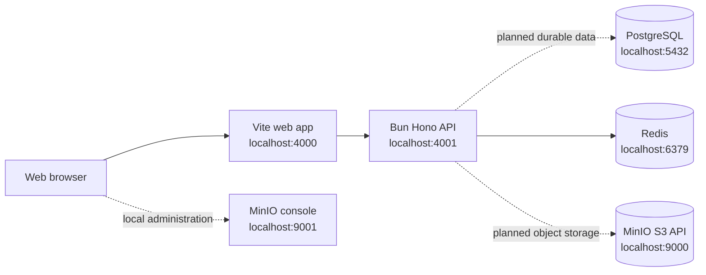

# TeamOS Infrastructure Guide

This guide describes the infrastructure used by TeamOS during local development and the current runtime boundaries between the web app, API, and supporting services.

## Architecture



The application processes run directly through Bun. Docker Compose currently provides PostgreSQL, Redis, and MinIO only.

## Service Map

| Service       | Local port | Current responsibility                | Current integration status                                              |
| ------------- | ---------: | ------------------------------------- | ----------------------------------------------------------------------- |
| Web           |     `4000` | Vite React client                     | Available through the web app dev command                               |
| API           |     `4001` | Hono HTTP API                         | Available through the API dev command                                   |
| PostgreSQL    |     `5432` | Durable relational data               | Provisioned; Drizzle schema and migrations are not implemented yet      |
| Redis         |     `6379` | Rate limiting and future coordination | Used by the API rate limiter                                            |
| MinIO API     |     `9000` | S3-compatible object storage          | Provisioned; storage client and object metadata are not implemented yet |
| MinIO console |     `9001` | Local object-storage administration   | Available for local inspection                                          |

## Starting Infrastructure

The root `.env` contains Docker Compose variables only. A fresh checkout can use the development defaults without creating that file.

```bash
docker compose up -d
docker compose ps
```

To stop the services while preserving named volumes:

```bash
docker compose down
```

To stop the services and delete all local database, Redis, and MinIO data:

```bash
docker compose down -v
```

The `-v` option is destructive for local persisted data and should not be used as a routine restart command.

## Environment Ownership

Each environment file has one owner:

| File            | Owner          | Purpose                                                        |
| --------------- | -------------- | -------------------------------------------------------------- |
| `.env`          | Docker Compose | PostgreSQL, Redis, and MinIO container defaults and host ports |
| `apps/api/.env` | API            | API port, allowed origins, limits, log level, and service URLs |
| `apps/web/.env` | Web            | Browser-visible API URL through `VITE_API_URL`                 |

Committed `.env.example` files document the accepted settings. Do not put API secrets or service credentials in frontend environment variables.

## PostgreSQL

PostgreSQL is created from the `postgres:16-alpine` image with the development database, user, and password configured by the root environment file. Its data is stored in the `postgres_data` named volume.

The API currently validates `DATABASE_URL`, but no database client, Drizzle schema, or migration is active yet. PostgreSQL is therefore infrastructure for the next persistence milestone rather than a live dependency of the current health endpoint.

Useful commands:

```bash
docker compose exec postgres pg_isready -U teamos -d teamos
docker compose logs -f postgres
```

## Redis

Redis runs with append-only persistence and a development password. Its data is stored in the `redis_data` named volume.

The API creates a lazy ioredis client and uses `rate-limiter-flexible` with a Redis-backed limiter. The limiter has an in-memory insurance limiter for the configured rate-limit window, while Redis remains the shared coordination path for multiple API processes.

Useful commands:

```bash
docker compose exec redis redis-cli -a teamos ping
docker compose logs -f redis
```

The password in these commands is the local default only. Use the configured `REDIS_PASSWORD` when the root environment overrides it.

## MinIO

MinIO exposes an S3-compatible API on `9000` and its local administration console on `9001`. Data is stored in the `minio_data` named volume.

The API currently validates `MINIO_ENDPOINT`, but it does not yet create buckets, sign URLs, upload objects, or store object ownership metadata. Those operations must be implemented behind authorized API endpoints before MinIO is used for avatars or attachments.

Open the local console at `http://localhost:9001` with the configured `MINIO_ROOT_USER` and `MINIO_ROOT_PASSWORD`.

Useful commands:

```bash
docker compose logs -f minio
curl http://localhost:9000/minio/health/live
```

## API Request Lifecycle

The API registers global middleware in this order:

1. CORS.
2. Security headers.
3. Request ID generation and response header propagation.
4. Client IP detection.
5. LogLayer request context.
6. Request start and completion logging.
7. Content-Type validation.
8. Request body size limit.
9. Request timeout.
10. CSRF protection.
11. Rate limiting, except for `/health`.
12. Route dispatch.
13. Consistent not-found and error response handling.

Error responses follow the shared API error contract and include the request ID when one is available. Unexpected errors are logged with server-side details but return a generic message to the client.

## Health Checks

Infrastructure containers have Docker health checks. The current API health route is:

```bash
curl http://localhost:4001/health
```

The API health response currently reports application status only. It does not yet perform dependency checks against PostgreSQL, Redis, or MinIO.

## Logging

The API redacts authorization headers, cookies, passwords, tokens, secrets, and API keys.

- `NODE_ENV=development` uses colored expanded terminal output for local readability.
- `NODE_ENV=test` uses the same readable transport when a real logger is created.
- `NODE_ENV=production` uses one structured JSON object per log entry for ingestion by a log platform.
- `LOG_LEVEL` controls the minimum emitted level in all environments.

Pretty output is a local presentation choice. It must not be used as a substitute for structured production logs.

## Local Commands

From the repository root:

```bash
bun install
bun run --cwd apps/api dev
bun run --cwd apps/web dev
bun run check
```

The API and web app can run without local infrastructure for the currently implemented root and health routes. Redis should be running when exercising the real Redis-backed rate limiter through `apps/api/src/server.ts`.

## Troubleshooting

Check service state and recent logs:

```bash
docker compose ps
docker compose logs --tail=100 postgres redis minio
```

If a port is occupied, either stop the conflicting process or override the corresponding host port in the root `.env`. The API port can be changed with `PORT` in `apps/api/.env`.

If Redis is unavailable, the API's Redis-backed limiter can reject protected requests because it is configured to fail closed. Tests and direct `createApp` callers use the explicit in-memory limiter instead.

## Shutdown and Data Safety

Use `docker compose down` for normal shutdown. Use `docker compose down -v` only when intentionally resetting local state. PostgreSQL remains the planned durable source of truth for TeamOS domain data; Redis and MinIO must not become the only copy of issues, messages, schedules, permissions, or object ownership metadata.

## Current Production Limitations

- PostgreSQL is not connected to application services yet.
- Better Auth and organization authorization are not implemented yet.
- MinIO has no application storage integration yet.
- API health checks do not include dependency readiness.
- Compose defaults are development-safe examples, not production credentials or deployment configuration.
- No production container orchestration or secret-management workflow is documented yet.
